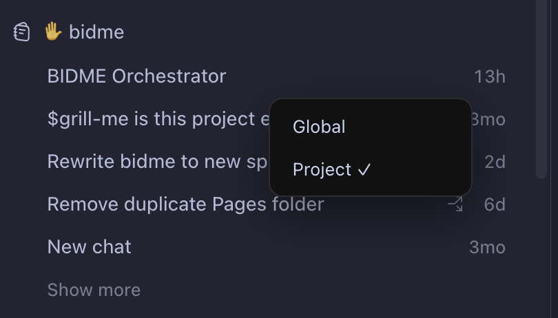
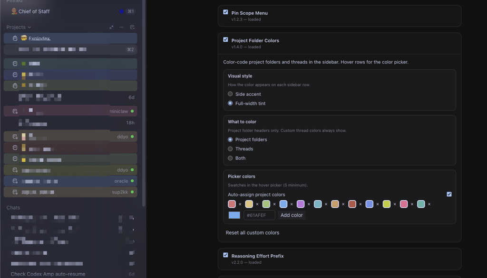
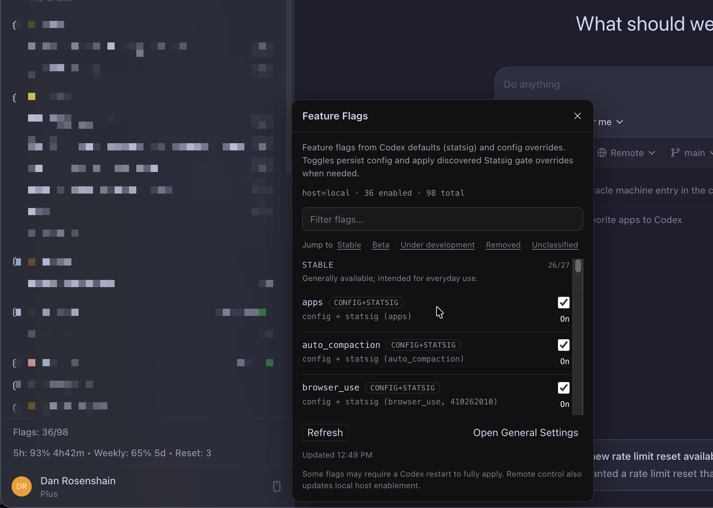

# Explodex 💥

**Mod the Codex desktop app.**

Explodex is an extension SDK for OpenAI's [Codex](https://openai.com/codex) desktop app — color-code your projects, keep usage and reset countdowns on screen, set reasoning effort with a keystroke, [or build your own by prompting Codex](#build-your-own-plugin).

[**Install in 30 seconds**](#install) · [Included plugins](#included-plugins) · [Build a plugin](#build-your-own-plugin) · [Docs](#docs)

<video src="https://github.com/user-attachments/assets/7cc60fed-cdc1-4083-8800-c493e2aa8025" width="100%" controls autoplay loop muted></video>

```sh
npm install -g explodex
explodex
```

## Why

Codex is great but closed. Explodex makes it malleable — so the tweak you keep wishing for is something you can just build. (Used BetterDiscord or Legcord? Same idea, for Codex.)

## Included plugins

Explodex ships with a handful of plugins — useful on their own, and good starting points to copy when building your own.

**💥 Explodex** sidebar item opens a settings page where you can enable/disable plugins and change their options.

| Plugin | What it does | Screenshot |
| ------ | ------------ | ---------- |
| [Usage and Reset Glance](plugins/usage-reset-glance/) | Keep usage and credit-reset countdowns on screen — no clicking into menus |  |
| [Project Pins](plugins/project-pins/) | Pin a thread to its project instead of globally, and keep it at the top |  |
| [Project Colors](plugins/project-colors/) | Color-code projects and their threads in the sidebar so you can tell them apart at a glance |  |
| [Threads in Command Menu](plugins/command-menu-threads/) | Find any thread from ⌘K — including threads inside collapsed projects, listed first |  |
| [Effort Shortcuts](plugins/effort-shortcuts/) | Set reasoning effort from the composer — type `!m` or `!xh`, stripped on send and restored after |  |
| [Feature Flags Playground](plugins/feature-flags-playground/) | Toggle Codex's experimental feature flags from Settings — changes persist across restarts |  |


## Build your own plugin

Explodex is meant to be modded *with* Codex. Clone the repo, open it in Codex (or any AI agent), and describe what you want — e.g. *"add a button that copies the thread as markdown."* Bundled agent skills drive the whole loop (scaffold → SDK hooks → validate → hot-reload into the live app, no restart):

- [`explodex-plugin-builder`](skills/explodex-plugin-builder/SKILL.md) — research → scaffold → implement → validate → verify
- [`explodex-live-plugins`](skills/explodex-live-plugins/SKILL.md) — prototype and hot-reload against the live renderer

The [SDK reference](docs/sdk-api.md) and [types](sdk/explodex-sdk.d.ts) keep the agent on stable surfaces; the included plugins double as templates.

<details>
<summary>Prefer to write one by hand? Here's a minimal plugin.</summary>

A plugin is a folder with a manifest and an entry script:

```text
my-plugin/
  plugin.json
  index.js
```

```js
// @ts-check
/// <reference path="../../sdk/explodex-sdk.d.ts" />

(function (global) {
  const Explodex = global.Explodex;
  if (!Explodex?.plugins?.register) return;

  Explodex.plugins.register(
    { id: "hello", name: "Hello", version: "1.0.0" },
    (api) => {
      const render = () =>
        api.mount("aboveComposer", () =>
          api.components.button({
            label: "Insert greeting",
            color: "secondary",
            size: "composerSm",
            onClick: () => api.composer.insertText("Hello! "),
          }),
        );

      render();
      const stop = api.waitFor("aboveComposer", render);
      return () => stop();
    },
  );
})(window);
```

Install user plugins under `~/.explodex/plugins/` (same layout). They override bundled plugins with the same id. In the sidebar, open **💥 Explodex** → **Open Plugins Folder** to reveal that directory.

See the [SDK API reference](docs/sdk-api.md) and the [development guide](docs/development.md) for the full workflow.

</details>

## Install

You'll need macOS, the [Codex desktop app](https://openai.com/codex) at `/Applications/Codex.app`, and a package manager ([Bun](https://bun.sh), npm, pnpm, or Yarn).

Install globally, then run `explodex`:

```sh
# pick one
npm install -g explodex
pnpm add -g explodex
bun install -g explodex
yarn global add explodex

explodex
```

The first run creates or repairs `~/Applications/Explodex.app` and opens it. The generated app is a local launcher: it does not modify, re-sign, or change the bundle ID of Codex. If plain Codex is already running, Explodex asks before quitting and relaunching it.

See [docs/installation.md](docs/installation.md) for commands, launch states, recovery, and logs.

### Install from source

To build plugins, clone the repo and run the dev loop:

```sh
git clone https://github.com/dan-dr/explodex.git
cd explodex
bun run dev
```

`bun run dev` packages the app, launches Codex with remote debugging, injects the SDK + plugins, and starts Chrome DevTools MCP for live renderer inspection — exactly the loop the agent skills drive. Dev state is isolated under `.explodex-user-data/`.

### Develop

Repo layout, the dev loop, validation, and the `bun run` commands live in **[docs/development.md](docs/development.md)**.

## How it works

Explodex creates a thin local launcher (`Explodex.app`) that starts the unmodified Codex executable with Chrome DevTools Protocol enabled, then injects the npm-packaged SDK and plugins. The SDK (`sdk/explodex-sdk.js`) provides:

- **DOM zones** — `aboveComposer`, `sidebar`, `composerActions`, and more
- **Components** — buttons, panels, toasts styled like Codex
- **Bridge** — AppServer router and Electron IPC to Codex internals
- **Plugin manager** — catalog, enable/disable, hot load in dev

## Compatibility & safety

Explodex injects locally into Codex's renderer. It **never modifies** your installed `/Applications/Codex.app` and runs entirely on your machine. Because it hooks Codex internals, a plugin may need an update when Codex ships a new release — see [docs/sdk-fragility.md](docs/sdk-fragility.md).

macOS only for now. Not affiliated with, endorsed by, or supported by OpenAI.

## Docs

| Doc | Contents |
| --- | -------- |
| [docs/sdk-api.md](docs/sdk-api.md) | **SDK API reference** (start here for plugin development) |
| [docs/development.md](docs/development.md) | Repo layout, validation, dev loop, commands |
| [docs/installation.md](docs/installation.md) | npm install, launcher states, commands, logs |
| [docs/local-development.md](docs/local-development.md) | Packaging, user data, plugin paths |
| [docs/codex-architecture.md](docs/codex-architecture.md) | Bundle topology, injection, IPC |
| [docs/composer-message-lifecycle.md](docs/composer-message-lifecycle.md) | Composer send APIs and hook points |
| [docs/sdk-fragility.md](docs/sdk-fragility.md) | What breaks across Codex updates |
| [docs/windows-feasibility.md](docs/windows-feasibility.md) | Windows feasibility spike; not a support claim |
| [docs/plugins/README.md](docs/plugins/README.md) | Bundled plugin notes |
