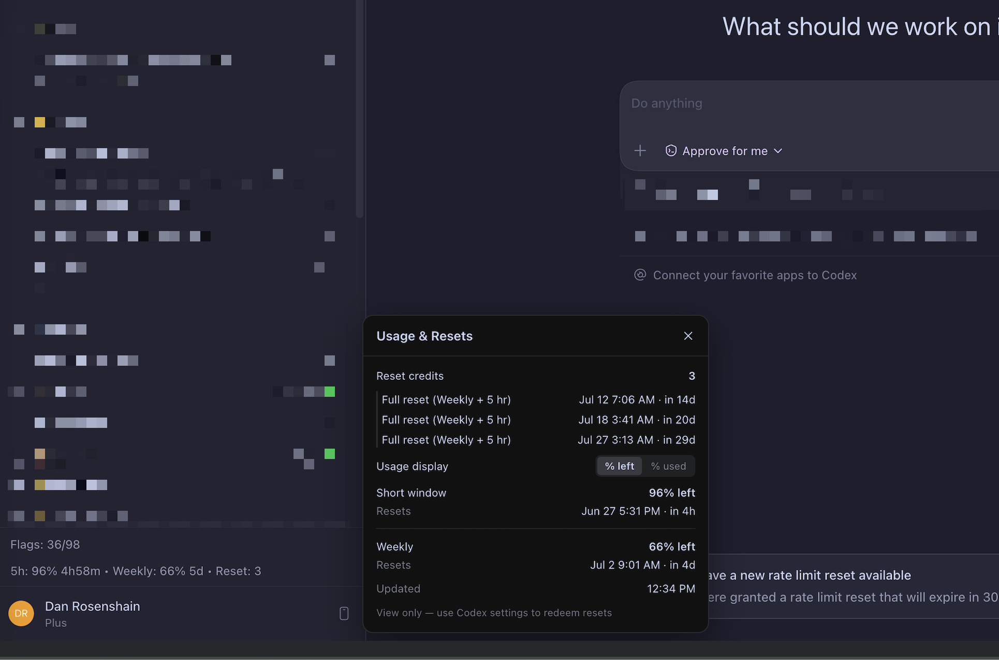
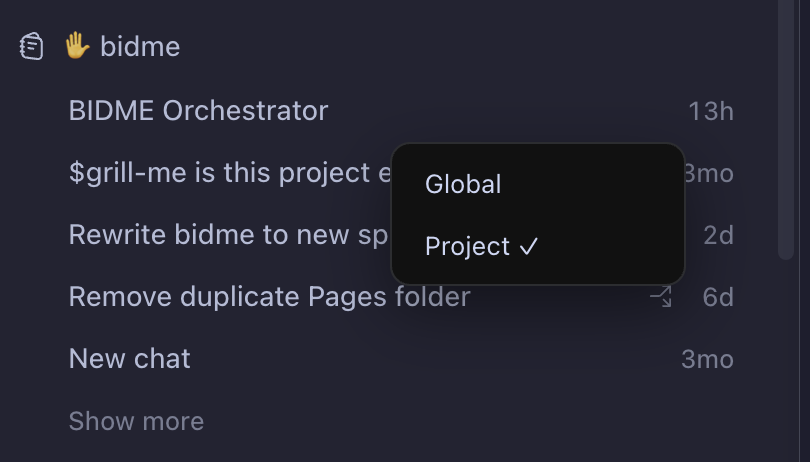
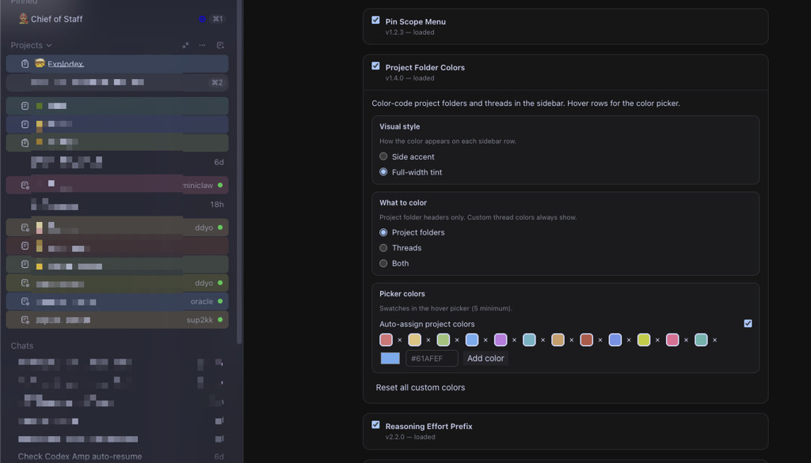
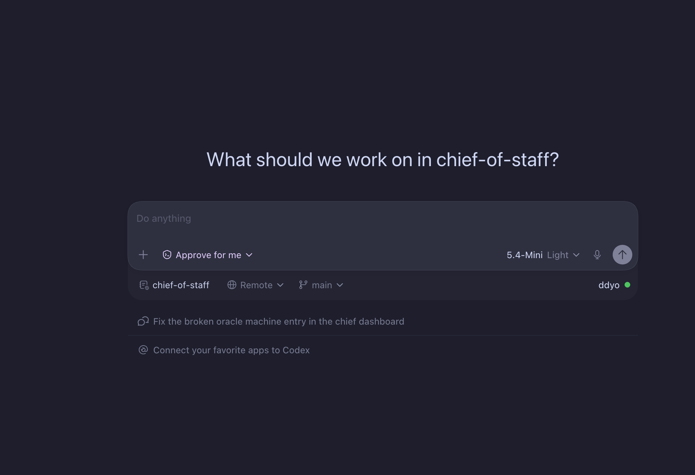
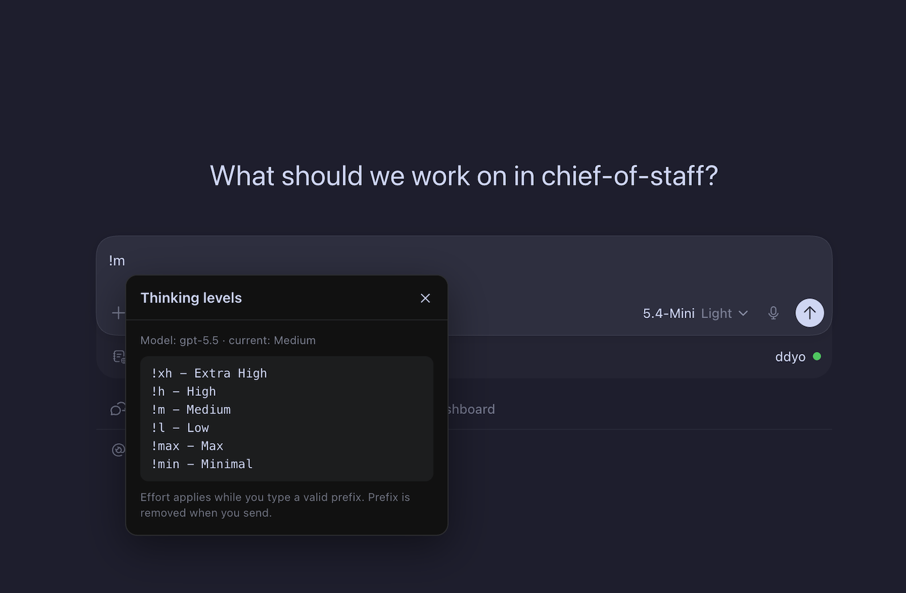
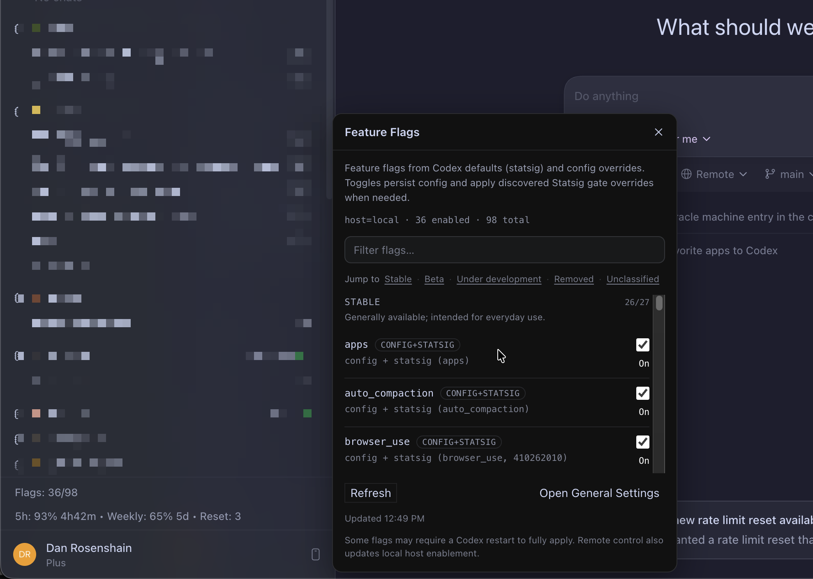

# Explodex 💥

**Mod Codex inside the ChatGPT desktop app.**

Explodex (`Ex`tension `pl`ugins for C`odex`) is a package SDK and CLI for extending Codex inside OpenAI's [ChatGPT desktop app](https://openai.com/chatgpt/desktop/) - color-code projects, keep usage and reset countdowns visible, set reasoning effort with a keystroke, or [build your own plugin](#build-your-own-plugin).

[**Install in 30 seconds**](#install) · [Included plugins](#included-plugins) · [Build a plugin](#build-your-own-plugin) · [Docs](#docs)

```sh
npm install -g explodex
explodex
```

<video src="https://github.com/user-attachments/assets/7cc60fed-cdc1-4083-8800-c493e2aa8025" width="100%" controls autoplay loop muted></video>

## Why

Codex is great but closed. Explodex makes it malleable - so the tweak you keep wishing for is something you can just build. (Used BetterDiscord or Legcord? Same idea, for Codex.)

## Included plugins

Explodex maintains seven first-party plugin packages, useful on their own and as
starting points for new plugins.

**💥 Explodex** sidebar item opens a settings page where you can enable/disable plugins and change their options.

| Plugin | What it does | Screenshot |
| ------ | ------------ | ---------- |
| [Usage and Reset Glance](packages/plugin-registry/explodex-plugin-usage-reset-glance/) | Keep usage and credit-reset countdowns on screen - no clicking into menus |  |
| [Project Pins](packages/plugin-registry/explodex-plugin-project-pins/) | Pin a thread to its project instead of globally, and keep it at the top |  |
| [Project Colors](packages/plugin-registry/explodex-plugin-project-colors/) | Color-code projects and their threads in the sidebar so you can tell them apart at a glance |  |
| [Threads in Command Menu](packages/plugin-registry/explodex-plugin-command-menu-threads/) | Find any thread from Cmd+K, including threads inside collapsed projects |  |
| [Effort Shortcuts](packages/plugin-registry/explodex-plugin-effort-shortcuts/) | Type `!m` or `!xh`; the prefix is stripped on send and prior effort is restored |  |
| [Toggle Autoscroll](packages/plugin-registry/explodex-plugin-toggle-autoscroll/) | Control autoscroll per thread above the composer | - |
| [Feature Flags Playground](packages/plugin-registry/explodex-plugin-feature-flags-playground/) | Toggle experimental feature flags from Settings |  |


## Build your own plugin

Use the plugin-builder skill to drive the package workflow: scaffold TypeScript,
use the public SDK, validate, build, package, then test against an exact
development target.

- [`explodex-plugin-builder`](skills/explodex-plugin-builder/SKILL.md): canonical workflow; uses an existing Explodex renderer when available and works offline when it is not

Install it with `npx skills add dan-dr/explodex`. The installed skill includes
an SDK API snapshot, type definitions, a package template, and validation tools,
so personal plugin work does not require an Explodex checkout.

The [SDK reference](docs/sdk-api.md) and package exports from `@explodex/sdk`
keep agents on stable surfaces; the included plugins double as templates.

```sh
explodex plugin create ./explodex-plugin-hello
cd explodex-plugin-hello
explodex plugin validate
explodex plugin build
explodex plugin package
```

The workspace imports `definePlugin` and `defineConfig` from `@explodex/sdk`.
The CLI creates generated-only `dist/` output and packages one immutable
archive. See the [SDK API reference](docs/sdk-api.md) and
[development guide](docs/development.md).

## Install

You'll need macOS, ChatGPT at `/Applications/ChatGPT.app`, Node.js 22 or 24,
and a package manager.

Install globally, then run `explodex`:

```sh
# pick one
npm install -g explodex
pnpm add -g explodex
bun install -g explodex
yarn global add explodex

explodex
```

Explodex keeps ChatGPT.app read-only and performs bounded one-shot operations.
See [docs/installation.md](docs/installation.md) for plugin sources, checksum
rules, review, and activation.

### Install from source

To work on the SDK, CLI, or first-party registry, clone the monorepo:

```sh
git clone https://github.com/dan-dr/explodex.git
cd explodex
bun install --frozen-lockfile
bun run build:npm
bun run validate
```

First-party plugins are seven independent TypeScript workspaces under
`packages/plugin-registry/explodex-plugin-*`. Use `explodex dev ensure` for the
isolated `127.0.0.1:9444` development instance.

### Develop

Repo layout, the dev loop, validation, and the `bun run` commands live in **[docs/development.md](docs/development.md)**.

## How it works

Explodex has three package boundaries: `@explodex/sdk` for authoring and the
generated renderer runtime, the `explodex` package CLI, and the private physical
first-party registry. The CLI validates immutable archives, records installed
state, obtains separate activation approval, and applies selected plugins to an
exact renderer. The SDK provides:

- **DOM zones** - `aboveComposer`, `sidebar`, `composerActions`, and more
- **Components** - buttons, panels, toasts styled like Codex
- **Bridge** - AppServer router and Electron IPC to Codex internals
- **Plugin lifecycle** - generated inert registration, explicit setup, tracked teardown

## Compatibility & safety

Explodex injects locally into Codex's renderer inside ChatGPT. It **never
modifies** `/Applications/ChatGPT.app`. Enabled plugins are trusted unsandboxed
renderer code, so only approve exact artifacts you trust. Because the SDK hooks
host internals, a plugin may need an update after a ChatGPT release. Re-run the
compatibility probe and isolated development proof after every host update.

macOS only for now. Not affiliated with, endorsed by, or supported by OpenAI.

## Docs

| Doc | Contents |
| --- | -------- |
| [docs/sdk-api.md](docs/sdk-api.md) | **SDK API reference** (start here for plugin development) |
| [docs/development.md](docs/development.md) | Repo layout, validation, dev loop, commands |
| [docs/installation.md](docs/installation.md) | npm installation, registry trust, commands |
| [docs/local-development.md](docs/local-development.md) | Isolated development lifecycle and plugin flow |
| [docs/decisions/](docs/decisions/) | Current package and runtime architecture decisions |
| [docs/windows-feasibility.md](docs/windows-feasibility.md) | Windows feasibility spike; not a support claim |
| [docs/plugins/README.md](docs/plugins/README.md) | First-party plugin notes |
