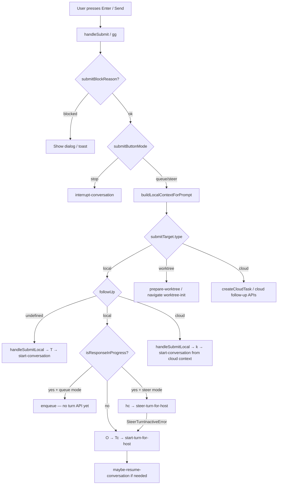

# Composer message-send lifecycle

> Reverse-engineered from `extracted/webview/assets/` (Codex v26.609.41114).  
> Related: [codex-architecture.md](./codex-architecture.md), [reasoning-effort-prefix-session.md](./reasoning-effort-prefix-session.md), plugin `plugins/reasoning-effort-prefix/index.js`.

This document maps **which bridge APIs** Codex calls when the user sends a message from the composer, **when** each is used, and **how to hook** plugin behavior into the official paths (instead of synthetic DOM resubmit).

---

## Table of contents

1. [High-level flow](#1-high-level-flow)
2. [Key state: followUp vs composerMode](#2-key-state-followup-vs-composermode)
3. [Bridge API reference](#3-bridge-api-reference)
4. [Where effort comes from on rollout](#4-where-effort-comes-from-on-rollout)
5. [Why reasoning-effort-prefix fails today](#5-why-reasoning-effort-prefix-fails-today)
6. [Hook strategies](#6-hook-strategies)
7. [Source files](#7-source-files)

---

## 1. High-level flow

User presses Enter or the send button → `handleSubmit` / `gg()` in `composer-Bc_CiLgC.js`.

```
Enter / Send
    → handleSubmit (gg)
    → validate blocks, goal replacement, side-chat shortcuts
    → buildLocalContextForPrompt + thread references
    → choose submitAction: stop | queue | steer
    → dispatch via submitTarget by composerMode
```

### Decision tree



### submitTarget by composerMode

| `composerMode` | `submitTarget.type` | Submit function | Bridge API(s) |
|----------------|---------------------|-----------------|---------------|
| `local` | `local` | `handleSubmitLocal` → `O()` in `yb()` | See [local follow-up](#local-existing-thread) |
| `worktree` | `worktree` | worktree init flow | `prepare-worktree-snapshot`, navigation to `/worktree-init-v2/...` |
| `cloud` | `cloud` | `zm()` / cloud task APIs | Cloud task creation, not local bridge turn APIs |

---

## 2. Key state: followUp vs composerMode

These are **orthogonal**. `followUp` decides new vs existing thread; `composerMode` decides local vs worktree vs cloud execution target.

### `followUp` (thread already exists?)

| `followUp` | Meaning | Local submit (`yb` → `handleSubmitLocal`) |
|------------|---------|-------------------------------------------|
| `{ type: "local", localConversationId }` | Existing local thread | `O()` → `Tc()` or `hc()` |
| `{ type: "cloud", ... }` | Cloud task follow-up | `k()` → `start-conversation` |
| `undefined` | New thread (home / no active thread) | `T()` → `start-conversation` |

**`start-conversation` is for new threads only** (home, cloud fork, worktree after init). Follow-ups in `/local/:id` use turn APIs, not `start-conversation`.

### Local existing thread (`O()` in `yb()`)

Calls `Tc()` (same logic as `je()` in `mention-metadata-syncer-O6MYPBSp.js`):

| Turn state | API |
|------------|-----|
| Turn `inProgress` + steer mode | `steer-turn-for-host` (fallback to `start-turn-for-host` on `SteerTurnInactiveError`) |
| No turn in progress | `start-turn-for-host` directly |

Optional preamble: `maybe-resume-conversation` if the conversation needs resume.

**Payload for `start-turn-for-host` (from composer):**

```javascript
{
  hostId,
  conversationId,
  params: {
    input: [{ type: "text", text, text_elements: [] }, ...images],
    cwd,
    model: null,    // inherits latestThreadSettings
    effort: null,   // inherits via collaborationMode (see §4)
    serviceTier,
    approvalPolicy,
    attachments,
    collaborationMode,  // from React activeMode — critical for effort
    ...
  }
}
```

### New thread (`T()` in `yb()`)

- Builds params via `yc()` / `Gr()` / `build-start-conversation-params`
- **`start-conversation`** with attachments
- Navigates to `/local/{conversationId}`

### Queue path

When a response is in progress and queue mode is enabled:

- Does **not** call turn APIs immediately
- `enqueue({ text, context, cwd })` — local queue UI
- `followUpSubmitAction === "queue"` when `followUp.type === "local"` && `isResponseInProgress`

---

## 3. Bridge API reference

All types go through `window.electronBridge.sendMessageFromView({ type, ... })` (wrapped by Explodex SDK `bridge.send`).

### Settings (effort only, no message)

| API | When called | Payload |
|-----|-------------|---------|
| **`update-thread-settings-for-next-turn`** | UI reasoning dropdown; plugins | `{ conversationId, threadSettings: { model, effort } }` |
| **`set-default-model-config-for-host`** | No active thread / home composer | `{ hostId, model, reasoningEffort, profile }` |

**Handler** (`app-main-B-r-lCO_.js`):

```javascript
"update-thread-settings-for-next-turn": async (manager, { conversationId, threadSettings }) => {
  await manager.updateThreadSettingsForNextTurn(conversationId, threadSettings);
}
```

**Manager** (`thread-context-inputs-BhGjWqLR.js` — `updateThreadSettingsForNextTurn`):

- Tracks `pendingThreadSettingsUpdates` promise per conversation
- Merges into `latestThreadSettings` via `Zu()` (sets `effort`, updates `latestCollaborationMode.settings.reasoning_effort`)
- Turn start calls `waitForPendingThreadSettingsUpdate(conversationId)` before reading effort

**UI guard** (`use-model-settings-B1SsY8bO.js`):

```javascript
C = r(sC, conversationId)  // sC: thread exists in manager (gw[conversationId] != null)
D = async (model, effort) => conversationId == null || !C
  ? false
  : (await bridge("update-thread-settings-for-next-turn", { conversationId, threadSettings: { model, effort } }), true)
```

Plugins should mirror the `sC` guard; calling the bridge without a loaded thread is a no-op or wrong-manager update.

### Turn APIs (composer local path)

| API | When called |
|-----|-------------|
| **`start-turn-for-host`** | Existing thread, idle (no in-progress turn) |
| **`steer-turn-for-host`** | In-progress turn + steer mode |
| **`maybe-resume-conversation`** | Thread paused / needs resume before steer |
| **`interrupt-conversation`** | Stop button — `{ conversationId, initiatedBy: "user" }` |

### New thread

| API | When called |
|-----|-------------|
| **`start-conversation`** | `followUp === undefined`, cloud fork, worktree completion |
| **`prewarm-thread-start-for-host`** | Optional prewarm before first turn |

### `send-follow-up-message` — not composer Enter

**Not used by the main composer.** Used by:

- `app-server-dynamic-tools-*.js` (MCP tools)
- Avatar overlay
- `mcp-capability-view-frame` (current-thread prompt)

Handler (`app-main-B-r-lCO_.js`, abbreviated):

```javascript
"send-follow-up-message": async (manager, { conversationId, prompt, model, reasoningEffort, serviceTier }) => {
  await maybeResume(...);
  if (model != null || reasoningEffort !== undefined) {
    await manager.updateThreadSettingsForNextTurn(conversationId, { model, effort: reasoningEffort ?? ... });
  }
  // steer-turn or start-turn with minimal text input
}
```

Coordinates settings + send in one handler, but **skips** the composer context builder (attachments, IDE context, mentions).

### Other composer-adjacent APIs

| API | Role |
|-----|------|
| `interrupt-conversation` | Stop in-progress turn |
| `maybe-resume-conversation` | Resume paused thread before turn |
| Side chat | `Tc()` with new `targetConversationId` |
| Goal / worktree / cloud | Separate branches in `gg()` |

---

## 4. Where effort comes from on rollout

Rollout JSONL `type == "turn_context"` → `.payload.effort` and `.payload.collaboration_mode.settings.reasoning_effort`.

Turn-start function `Rp` in `thread-context-inputs-BhGjWqLR.js`:

```javascript
S = a.collaborationMode != null
T = S ? null : (a.effort === void 0 ? C : a.effort)
// ...
effort: T  // in thread/start request
```

When `collaborationMode` is present (normal composer submits), **`params.effort` is forced to `null`**. Effort is taken from **`collaborationMode.settings.reasoning_effort`**, not from `latestThreadSettings` directly at request time.

### How collaborationMode is built at submit

1. `gg()` calls `buildLocalContextForPrompt(prompt, undefined, conversationId)` — second arg `collaborationMode` is often `undefined`
2. `start-turn-for-host` uses `collaborationMode: context.collaborationMode ?? activeCollaborationMode`
3. `activeCollaborationMode` comes from `use-collaboration-mode` → overlays `modelSettings.reasoningEffort` onto mode settings
4. `modelSettings.reasoningEffort` comes from `use-model-settings` → per-thread signal `et` (manager) or host config

**UI dropdown:** user changes effort → `update-thread-settings-for-next-turn` → user sends **later** → React re-renders → `activeMode.settings.reasoning_effort` is current → rollout matches.

**Plugin (today):** bridge update → strip prefix → **~32ms synthetic Enter** → submit before React re-renders → **stale** `activeMode` → rollout unchanged.

---

## 5. Why reasoning-effort-prefix fails today

| | UI | Plugin (current) |
|---|-----|------------------|
| Set effort | `update-thread-settings-for-next-turn` | Same ✓ |
| Timing | Change effort, send later | `await` settings, then immediate synthetic resubmit |
| Send path | Native `gg` → `start-turn-for-host` | Synthetic `keydown` / button click |
| Effort on wire | Fresh `collaborationMode` from React | Stale `collaborationMode` |

### Failure modes (ranked)

1. **Stale React collaboration mode** (primary) — manager updated; submit still ships old `reasoning_effort` in `collaborationMode`
2. **Synthetic submit** — ProseMirror uses internal `f.emit("submit")` on Enter keymap, not DOM `keydown` on `window`
3. **DOM text strip** — submit reads `composerController.getText()` from ProseMirror doc, not `textContent`; `setComposerText` via execCommand may desync
4. **Missing `sC` guard** — settings update when thread not in manager atom `gw`
5. **Queue / in-progress** — official path uses `steer-turn-for-host`; synthetic submit may not respect branch

### What is not the issue

- Wrong settings API name (`threadSettings.effort` is correct, same as UI)
- Composer intentionally sending `effort: null` in params (by design; effort flows via `collaborationMode`)

---

## 6. Hook strategies

**Do not rely on synthetic Enter** as the primary send mechanism.

### Option D — Live apply while typing + restore (preferred for prefix plugin)

Apply `update-thread-settings-for-next-turn` as soon as a **valid** prefix is detected (`!xh `, etc.), not at Enter. Intelligence UI should update during typing. Restore previous effort after send (once turn has started), or when prefix is deleted/invalid. Strip raw prefix from composer text and show an effort pill in `aboveComposer` portal. User sends with **native Enter** — no synthetic resubmit. See [reasoning-effort-prefix-session.md §11](./reasoning-effort-prefix-session.md#11-option-d-live-apply--restore--pill).

### Option A — Intercept prefix, then native submit after React sync

1. `preventDefault` on Enter when prefix matches
2. `await update-thread-settings-for-next-turn`
3. Strip prefix via ProseMirror-safe replace (equivalent to `composerController.setPromptText`, not DOM-only)
4. Wait for manager/React sync (`requestAnimationFrame` × 2, conversation callback, or microtask chain)
5. Trigger **native** submit (ProseMirror submit event path, not raw DOM Enter)

Stays on official `gg` → `handleSubmitLocal` → `start-turn-for-host` with full context (attachments, mentions, IDE).

### Option B — `send-follow-up-message`

```javascript
await bridge.send("send-follow-up-message", {
  conversationId,
  prompt: strippedText,
  reasoningEffort: level.effort,
  model: null,
  serviceTier,
});
```

Atomic settings + send. Skips composer context builder.

### Option C — Direct `start-turn-for-host` with explicit effort

1. `update-thread-settings-for-next-turn`
2. `await wait` / manager callback
3. `start-turn-for-host` with **`effort: "medium"`** (explicit) and **`collaborationMode: null`** so `Rp` reads from `latestThreadSettings` after `waitForPendingThreadSettingsUpdate`

Must branch `steer-turn-for-host` when turn in progress. Must build or accept reduced context.

### Option D — Update React-visible state

After bridge update, invalidate/update the same React Query keys as `use-model-settings` so `use-collaboration-mode` sees new `reasoning_effort` before submit.

### New threads only

Use `set-default-model-config-for-host` before `start-conversation` (plugin already has this fallback when `conversationId` is null).

---

## 7. Source files

| Path | Role |
|------|------|
| `extracted/webview/assets/composer-Bc_CiLgC.js` | `handleSubmit` / `gg()`, `yb()`, `submitTarget`, queue |
| `extracted/webview/assets/mention-metadata-syncer-O6MYPBSp.js` | `je()` / `Tc()` → `start-turn-for-host`, `steer-turn-for-host` |
| `extracted/webview/assets/app-main-B-r-lCO_.js` | Bridge handler registry |
| `extracted/webview/assets/thread-context-inputs-BhGjWqLR.js` | `updateThreadSettingsForNextTurn`, `Rp` turn start, `waitForPendingThreadSettingsUpdate` |
| `extracted/webview/assets/use-model-settings-B1SsY8bO.js` | UI effort API, `sC` guard |
| `extracted/webview/assets/use-collaboration-mode-C3U79kbx.js` | `activeMode.settings.reasoning_effort` at submit |
| `extracted/webview/assets/composer-controller-CNXNPPdo.js` | ProseMirror Enter → `f.emit("submit")` |
| `plugins/reasoning-effort-prefix/index.js` | Explodex plugin (current implementation) |
| `sdk/explodex-sdk.js` | `bridge.send`, composer helpers |

### Verification

Watch effort on rollout:

```bash
tail -f ~/.codex/sessions/.../rollout-*.jsonl \
  | jq -c 'select(.type=="turn_context") | {ts:.timestamp, effort:.payload.effort, model:.payload.model}'
```
