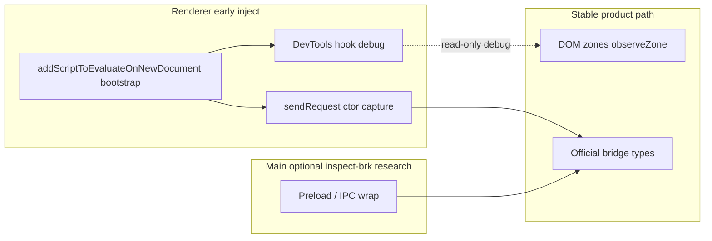

# Early injection, `--inspect-brk`, and massive patching

> Date: 2026-06-22  
> Context: Follow-up to [sdk-fragility.md](./sdk-fragility.md) §1 (AppServer `call/apply` capture) and the question whether early breakpoints enable React component / props interception.  
> Related: [codex-root-runtime.md](./codex-root-runtime.md), [codex-architecture.md](./codex-architecture.md) §11, [composer-message-lifecycle.md](./composer-message-lifecycle.md).

This document explains what `--inspect-brk` actually pauses in Codex/Electron, how that compares to Explodex’s existing CDP early-inject path, what “massive” patches are realistic at startup, and why they still do not generalize to injecting props into arbitrary React components.

**Status:** Research / architecture guidance only — no bootstrap or inspect-brk launch mode is implemented yet.

---

## Table of contents

1. [Executive summary](#1-executive-summary)
2. [Two processes, two clocks](#2-two-processes-two-clocks)
3. [What Explodex already does](#3-what-explodex-already-does)
4. [Tiered “massive” patch targets](#4-tiered-massive-patch-targets)
5. [Can early patch inject React props?](#5-can-early-patch-inject-react-props)
6. [Recommended architecture](#6-recommended-architecture)
7. [Research spike (manual)](#7-research-spike-manual)
8. [Anti-patterns](#8-anti-patterns)
9. [Future work](#9-future-work)

---

## 1. Executive summary

| Question | Answer |
|----------|--------|
| Does `--inspect-brk` pause React before it loads? | **No** — it pauses the **Electron main** process, not the webview renderer. |
| Is there already a “break before page JS” path? | **Yes** — CDP `Page.addScriptToEvaluateOnNewDocument` in `scripts/cdp-inject.ts` (`world: "MAIN"`). |
| Can we patch something massive and inject component props? | **Only in narrow, targeted ways** — not as a generic React interception framework. |
| Best massive early patch for Explodex? | **DevTools hook + constructor-site `sendRequest` capture** — not widening `Function.prototype.call/apply`. |
| Best stable product path? | DOM zones + official bridge APIs ([codex-architecture.md](./codex-architecture.md) §10–12). |

`--inspect-brk` feels like “pause the universe, install a god hook, resume.” In practice you choose **which isolate** (main vs renderer) and **which choke point** (preload, preamble script, Fetch rewrite). Renderer React integration needs **renderer-before-modules**, which `addScriptToEvaluateOnNewDocument` already provides when registered before navigation (or after a reload).

---

## 2. Two processes, two clocks

Electron Codex runs at least two V8 isolates relevant to Explodex:

```
┌─────────────────────────────────────────────────────────────┐
│ Main process (--inspect-brk=9229 pauses HERE)               │
│  bootstrap.js → main-*.js                                     │
│  BrowserWindow, preload path, IPC handler registration      │
└──────────────────────────┬──────────────────────────────────┘
                           │ creates window + loads preload
                           ▼
┌─────────────────────────────────────────────────────────────┐
│ Renderer (webview/index.html + Vite ES module chunks)       │
│  --remote-debugging-port=9333 (CDP attach, no auto-break)   │
│  React SPA, composer, in-renderer AppServer router          │
└─────────────────────────────────────────────────────────────┘
```

| Target | Typical flag | What pauses / attaches |
|--------|--------------|------------------------|
| **Main process** | `Codex --inspect-brk=9229` | Node bootstrap before `runMainAppStartup()` proceeds. Blocks until a debugger attaches and resumes. |
| **Renderer** | `--remote-debugging-port=9333` | CDP server for DevTools/MCP. Does **not** break on first line unless you set breakpoints or use early script injection. |
| **Renderer before page JS** | CDP `Page.addScriptToEvaluateOnNewDocument` | Script runs in **main world** before the document’s own scripts on each navigation. |

**Implication:** Main-process `inspect-brk` is the right layer for **preload / IPC / window options**. It does **not** directly pause React. Renderer React hooks require **renderer early preamble** or **reload after** registering `addScriptToEvaluateOnNewDocument`.

Preload (`preload.js`) runs in an **isolated world** with `contextBridge` — it cannot see React fibers in the main world without deliberately exposing more surface.

---

## 3. What Explodex already does

`scripts/cdp-inject.ts` registers the SDK (and catalog) via:

1. **`Page.addScriptToEvaluateOnNewDocument`** — `world: "MAIN"` — runs before page scripts on new documents.
2. **`Runtime.evaluate`** — immediate inject into already-loaded pages.

`scripts/launch.sh` starts Codex with `--remote-debugging-port=9333` and runs the injector when the port is up.

### Why AppServer capture still fails today

The SDK’s `Function.prototype.call/apply` monkeypatch (top of `sdk/explodex-sdk.js`) is a **late heuristic**:

- Injection often happens **after** React and the in-renderer router have already initialized.
- Router methods may be invoked as **direct calls** (`sendRequest(type, payload)`), not via `.call/.apply`, so the trap never binds `__explodexAppServerSend`.

Early preamble injection fixes **timing**; it does not by itself fix **wrong hook point** (prototype patch vs constructor capture). See [sdk-fragility.md](./sdk-fragility.md) §1 and [reasoning-effort-prefix-session.md](./reasoning-effort-prefix-session.md) §12.

### Late attach mitigation

`EXPLODEX_TARGET_WATCH_MS` (default `8000`) watches for additional renderer targets during startup. Plugins that depend on React-owned DOM should use `observeZone()` and reload after inject if bootstrap must run before modules.

---

## 4. Tiered “massive” patch targets

“Massive” means wide blast radius — acceptable only when the patch is **targeted** and **telemetry-backed**, not when it wraps every function invocation in the app.

### Tier A — Early renderer preamble (best ROI)

Inject **before** `webview/index.html` loads its module graph. Deliver via `addScriptToEvaluateOnNewDocument` (or ASAR `index.html` patch for self-contained builds).

| Patch | What it gets you | Props injection? |
|-------|------------------|------------------|
| **`window.__REACT_DEVTOOLS_GLOBAL_HOOK__`** | `onCommitFiberRoot` / post-commit signals; fiber ↔ DOM mapping | Observe only; no stable component names after minify |
| **Constructor-site `sendRequest` capture** | Reliable in-renderer bridge (fixes settings path) | N/A — behavior API, not UI props |
| **`history.pushState` / `replaceState` wrap** | Route changes without fiber | N/A |
| **`Element.prototype.appendChild` wrap** | Portal anchor appearance (DOM-level) | No — sees nodes, not React props |

**React DevTools hook sketch (research):**

```javascript
window.__REACT_DEVTOOLS_GLOBAL_HOOK__ = {
  inject() {},
  onCommitFiberRoot(id, root) {
    // observe commits; map host fibers to data-* portal nodes
  },
  onPostCommitFiberRoot() {},
};
```

Must exist **before** `react-dom/client` initializes. [codex-root-runtime.md](./codex-root-runtime.md) notes the hook was absent in a post-hoc inspected session — consistent with injecting too late.

**Narrow patches vs `Function.prototype`:** Prefer one hook with a clear contract over patching all `.call/.apply` ([plans/narrow-appserver-capture.md](../plans/narrow-appserver-capture.md)).

### Tier B — Main process at `--inspect-brk` (different layer)

While main is paused on port `9229`, research options include:

| Change | Effect |
|--------|--------|
| Wrap `contextBridge.exposeInMainWorld("electronBridge", …)` in preload | Stable, logged IPC surface; optional explicit renderer forwarding |
| Patch `BrowserWindow` `webPreferences` | Custom preload, `additionalArguments`, dev-only flags |
| Wrap `ElectronMessageHandler` dispatch | Log or filter `message-from-view` types |

**Gets you:** reliable `electronBridge`, intentional IPC routing.  
**Does not get you:** React props — main isolate does not run the SPA.

Use main `inspect-brk` when the goal is **bridge reliability**, not component tree surgery.

### Tier C — CDP Fetch / debugger rewrite (nuclear, research-only)

With CDP attached before chunks load:

| Technique | Effect |
|-----------|--------|
| **`Fetch.enable` + `Fetch.fulfillRequest`** | Rewrite `webview/assets/composer-*.js` on the wire |
| **`Debugger.setBreakpointByUrl`** on first module | Pause → `Runtime.evaluate` patch → resume |

**Gets you:** literal surgery inside a known minified chunk.  
**Costs:** hashed filenames change every release; high maintenance; possible integrity/policy friction.

**Not** a product architecture — document findings only.

---

## 5. Can early patch inject React props?

**Theoretically in narrow cases; not as a general Explodex platform API.**

### Why `call/apply` ≠ component interception

The AppServer trap works as **runtime object archaeology**: scan invocations until `this` looks like `{ sendRequest, setMessageHandler }`. React components differ:

| Factor | AppServer trap | React props injection |
|--------|----------------|----------------------|
| Invocation | Sometimes `.call(thisArg, …)` | Usually `Component(props)` or internal `jsx(type, props)` |
| Identity | Method name pair | Minified `e`, `t`, `n` — no stable names |
| Data location | `thisArg` | Props in **first argument**, not `this` |
| Reconciliation | Capture once | Injected props overwritten on next commit unless hooked every render |

### Approach matrix

| Approach | Inject props? | Viability in Codex |
|----------|-----------------|-------------------|
| `Function.prototype.call/apply` trap | Practically no | Wrong model; already unreliable |
| Fiber walk + **read** `memoizedProps` | Read only | `Explodex.codex.*` today |
| Fiber **`memoizedProps` mutation** | Briefly | Corrupts scheduler; forbidden ([codex-root-runtime.md](./codex-root-runtime.md)) |
| DevTools hook at startup | Observe / debug wrap | Promising for **telemetry**, not production plugins |
| Patch global `jsx` / `createElement` | Yes at create time | Not global — locked inside Vite chunks |
| Fetch rewrite of one chunk | Yes, surgically | Unmaintainable per build |
| DOM zones + bridge | Parallel UI + behavior | **Stable** product path |

### The one narrow analog that works

**Callback fingerprinting** (already in SDK): find `useCallback` tuples whose `Function.toString()` contains `"update-thread-settings-for-next-turn"` and invoke them. That intercepts a **known Codex function** by string literal, not React components generically ([sdk-fragility.md](./sdk-fragility.md) §2.3).

Early massive patch improves **discovery and capture** at startup; it does not turn minified React into a stable props-injection API.

---

## 6. Recommended architecture



### Production Explodex (recommended)

1. **Split bootstrap from full SDK** — small `explodex-bootstrap.js` via `addScriptToEvaluateOnNewDocument`:
   - AppServer constructor capture (narrow)
   - `window.__EXPLODEX_BOOT__` capability flags
   - Optional DevTools hook behind `localStorage` debug flag
2. **Load full SDK** after bootstrap (current catalog inject path).
3. **Do not** use `inspect-brk` as default dev loop — blocks until debugger attaches; `launch.sh` would hang without auto-resume automation.
4. **Reload renderer** after first inject when testing bootstrap timing (Cmd+R or CDP `Page.reload`).

### Research vs product boundaries

| Capability | Layer | Ship to users? |
|------------|-------|----------------|
| `sendRequest` capture at ctor | bootstrap | Yes, when probed stable |
| `meta.capabilities.inRendererSettings` | SDK | Yes |
| DevTools `onCommitFiberRoot` logging | bootstrap debug | No — dev only |
| Fiber `memoizedProps` write | — | **Never** |
| Fetch chunk rewrite | CDP research | **Never** |
| Main preload wrap | vendor patch research | Maybe, version-gated |

---

## 7. Research spike (manual)

Not wired into `launch.sh`. For local investigation only.

### Launch with both debug ports

```bash
CODEX_ELECTRON_USER_DATA_PATH="$HOME/.explodex" \
  ./vendor/Codex.app/Contents/MacOS/Codex \
  --inspect-brk=9229 \
  --remote-debugging-port=9333
```

Process blocks on main until Node inspector resumes.

### Attach and probe

1. **Main (9229)** — Chrome `chrome://inspect` or `node inspect` → resume → inspect `BrowserWindow` / preload path in `main-*.js`.
2. **Renderer (9333)** — `http://127.0.0.1:9333/json/list` → register bootstrap via CDP `Page.addScriptToEvaluateOnNewDocument` (or `bun run inject` after adding bootstrap).
3. **Reload** renderer so preamble runs before React modules.
4. **Verify:**
   - `window.__explodexAppServerSend` or boot flag set before first `update-thread-settings-for-next-turn`
   - DevTools hook fires `onCommitFiberRoot`
   - `Explodex.codex.applyThreadSettingsForNextTurn` succeeds without fiber fallback (stretch goal)

### Success criteria for bootstrap spike

| Probe | Pass |
|-------|------|
| Bootstrap runs before `#root` module | `performance.now()` or ordered console marks |
| In-renderer `sendRequest` bound | Settings change visible in UI before send |
| No `Function.prototype` patch required | Prototype chain clean |
| Full SDK reload/inject idempotent | `Explodex.destroy({ reason: "reload" })` still works |

---

## 8. Anti-patterns

1. **Default `inspect-brk` in `launch.sh` / `bun run dev`** — blocks on debugger; poor DX without headless auto-resume.
2. **Widening `Function.prototype.call/apply`** for React — wrong invocation model; perf and conflict risk ([sdk-fragility.md](./sdk-fragility.md) §1).
3. **Mutating fiber `memoizedProps`** for plugins — reconciliation corruption ([codex-root-runtime.md](./codex-root-runtime.md)).
4. **Fetch-rewriting production chunks** — unmaintainable across hashed Vite outputs.
5. **Treating DevTools hook as public plugin API** — provider values may contain sensitive account data; read-only, allowlisted summaries only.
6. **Assuming main `inspect-brk` pauses React** — two isolates; renderer needs its own early inject.

---

## 9. Future work

| Item | Doc / plan |
|------|------------|
| `explodex-bootstrap.js` + capability probe | This doc §6; [sdk-fragility.md](./sdk-fragility.md) §13 |
| Narrow AppServer capture | [plans/narrow-appserver-capture.md](../plans/narrow-appserver-capture.md) |
| Optional `--inspect-brk` launch profile | `scripts/launch.sh` flag + docs (not implemented) |
| Debug-only `Explodex.debug.findOwnerFiber(el)` | [codex-root-runtime.md](./codex-root-runtime.md) |
| CDP smoke test: bootstrap before React | [plans/runtime-smoke-tests.md](../plans/runtime-smoke-tests.md) |

---

## See also

- [sdk-fragility.md](./sdk-fragility.md) — breakage tiers, fiber/bridge risks
- [codex-root-runtime.md](./codex-root-runtime.md) — `window.__codexRoot`, fiber read-only rules
- [composer-message-lifecycle.md](./composer-message-lifecycle.md) — why renderer bridge path matters for settings
- [codex-architecture.md](./codex-architecture.md) §11 — injection methods (CDP vs ASAR)