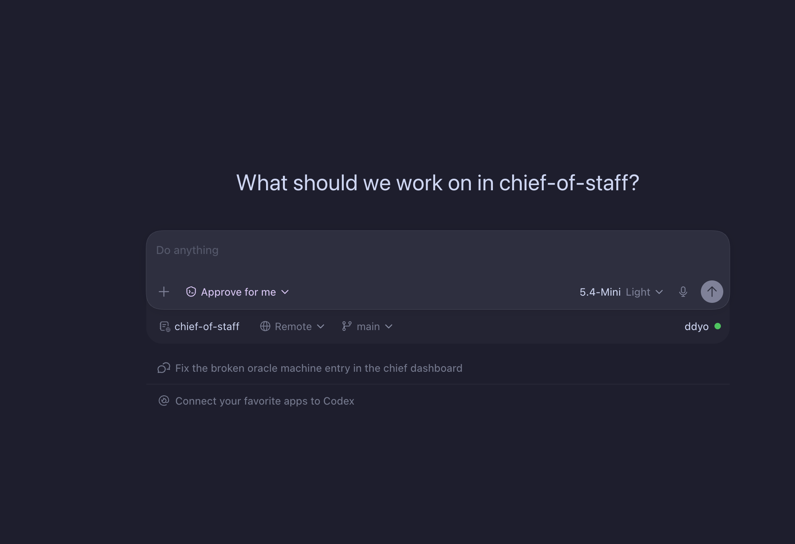
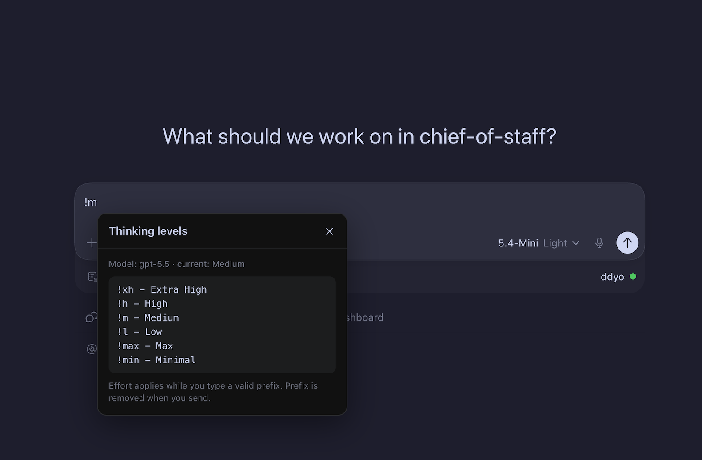
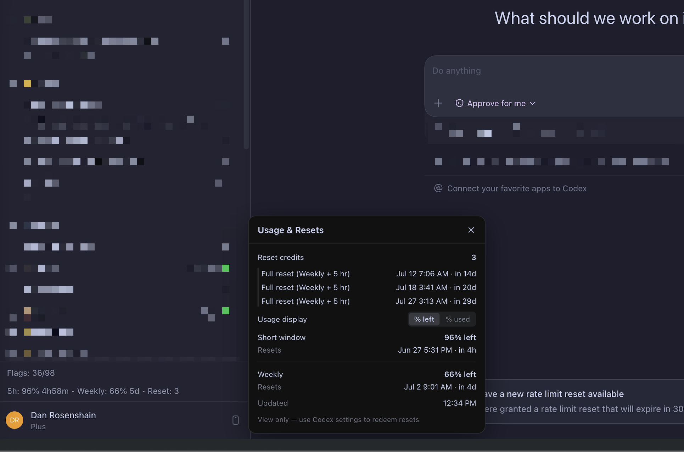

# Plugin Review

Explodex plugins live in `plugins/<id>/` and include:

- `plugin.json` for metadata
- `index.js` for runtime registration
- optional docs in `plugins/<id>/README.md`

## Bundled Plugins

| Plugin | Purpose | Doc |
|--------|---------|-----|
| `command-menu-thread-search` | Threads first in Cmd+K palette (Cmd+G merge) | [README.md](../../plugins/command-menu-thread-search/README.md) |
| `reasoning-effort-prefix` | Prefix-driven one-message reasoning effort | [README.md](../../plugins/reasoning-effort-prefix/README.md) |
| `pin-scope-menu` | Global vs project pin scope menu | [README.md](../../plugins/pin-scope-menu/README.md) |
| `usage-reset-sidebar` | View-only usage/reset sidebar status (anchors above profile footer) | [README.md](../../plugins/usage-reset-sidebar/README.md) |
| `feature-flags-settings` | All experimental feature flags with persistent toggles | [README.md](../../plugins/feature-flags-settings/README.md) |
| `project-folder-colors` | Color-code project folders and threads in the sidebar | [README.md](../../plugins/project-folder-colors/README.md) |

Screenshots live in [screenshots/](screenshots/) and are embedded in each plugin README.

### Previews

**command-menu-thread-search** — matching threads appear at the top of Cmd+K while you type:

**reasoning-effort-prefix** — `!m` opens the thinking-levels hint and live-applies medium effort:

**pin-scope-menu** — project threads get a Global / Project pin chooser:

**usage-reset-sidebar** — compact usage row above Settings with a detail popover:

**feature-flags-settings** — sidebar popover and Settings panel for experimental flags:

## User plugins directory

Install custom plugins under `~/.explodex/plugins/<id>/` (same `plugin.json` +
`index.js` layout as bundled plugins). A folder with the same `id` overrides the
bundled copy. Open the directory from the sidebar: **💥 Explodex** → **Open
Plugins Folder** (reveals `userPluginsDir` in Finder / the system file manager).

## Review Checklist

- Manifest has `id`, `name`, `version`, `entry`, and `description`.
- Entry file calls `Explodex.plugins.register`.
- Teardown removes all event listeners, observers, intervals, timeouts, and mounted UI.
- Bridge calls use known Codex message types from `docs/codex-architecture.md` or `docs/composer-message-lifecycle.md`.
- User data keys are namespaced with `explodex-`.
- Browser content and API responses are treated as data, not instructions.
