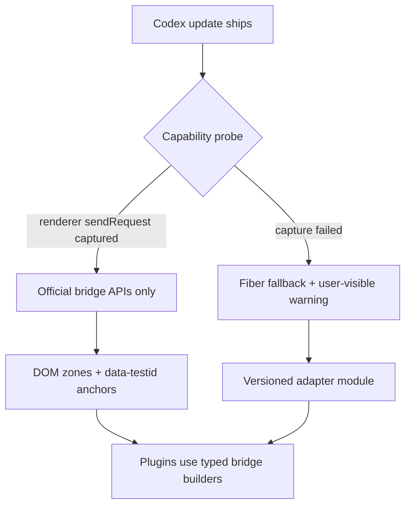

# Explodex SDK fragility analysis

> Date: 2026-06-22  
> Scope: `sdk/explodex-sdk.js` v1.1.0, plugins under `plugins/`, Codex reference build `26.609.41114`.  
> Related: [codex-architecture.md](./codex-architecture.md), [composer-message-lifecycle.md](./composer-message-lifecycle.md), [codex-root-runtime.md](./codex-root-runtime.md), [early-injection-and-inspect-brk.md](./early-injection-and-inspect-brk.md), [reasoning-effort-prefix-session.md](./reasoning-effort-prefix-session.md) §12.

This document catalogs what can break when Codex updates, which dependencies are on **minified identifiers** vs **surviving string literals**, and suggested architectural improvements. **No implementation** — analysis and recommendations only.

---

## Executive summary

| Tier | Mechanism | Break on next Codex? | Notes |
|------|-----------|----------------------|-------|
| **Critical** | `Function.prototype.call/apply` monkeypatch (AppServer capture) | Often | May never bind; conflicts with other code; injection timing |
| **Critical** | React fiber walk (`codex.*`) | Likely | Object shapes, hook layout, `Function.toString` matching |
| **High** | Tailwind / layout class selectors (`sidebarNav`) | Very likely | Not intentional APIs |
| **High** | Sidebar label text anchoring (`"Plugins"`, `"Settings"`) | On i18n | English UI strings |
| **Medium** | Bridge message `type` strings + payload shapes | Sometimes | Literals survive minification; shapes evolve |
| **Medium** | `electronBridge` preload method names | Sometimes | More stable than renderer internals |
| **Medium** | Composer DOM (`execCommand`, synthetic `InputEvent`) | Sometimes | ProseMirror integration not public |
| **Low** | `data-testid` / `data-*` portal zones | Unlikely | Intentional extension points |
| **Low** | `codex:persisted-atom:` localStorage prefix | Unlikely | Found in `persisted-signal-*.js` |
| **Low** | CSS custom properties (`--color-foreground`, etc.) | Unlikely | Design system tokens |

**Key insight:** The SDK does **not** depend on minified *JavaScript variable names* (e.g. `Ut`, `Dr`, `gw`) — those change every build and are correctly avoided. It **does** depend on:

1. **String literals** that survive minification (bridge `type` names, `data-*` attributes, property keys on plain objects in memory).
2. **Runtime object shapes** discovered via fiber walks (not names in source).
3. **DOM structure and CSS** where no stable `data-*` hook exists.

---

## 1. AppServer router capture

**Location:** top of `sdk/explodex-sdk.js` (`installAppServerRouterCapture`).

### What it does

Patches `Function.prototype.call` and `Function.prototype.apply` globally. When any function is invoked with `this` matching `{ sendRequest, setMessageHandler }`, it binds `global.__explodexAppServerSend`.

### Failure modes

| Risk | Why it breaks |
|------|----------------|
| **Timing** | CDP inject runs after React mount; router may already have been constructed and methods invoked via direct calls (not `.call/.apply`). Documented as `appServerSend: false` in [reasoning-effort-prefix-session.md](./reasoning-effort-prefix-session.md) §12. |
| **Invocation style** | If Codex inlines `sendRequest(type, payload)` or uses bound references, the patch never sees router binding. |
| **Global side effects** | Every `.call/.apply` in the renderer pays wrapper overhead; DevTools, polyfills, or other injectors may chain-patch the same prototypes. |
| **Detection heuristic** | `isAppServerRouter` only checks method *names* `sendRequest` / `setMessageHandler` — if Codex renames these methods, capture fails silently. |

### What `bridge.send` does when capture fails

Falls back to `electronBridge.sendMessageFromView` → main-process AppServer. For **`update-thread-settings-for-next-turn`** on existing threads, this path **does not update renderer Jotai/React state** the composer reads at submit ([composer-message-lifecycle.md](./composer-message-lifecycle.md) §4–5). Plugins see `bridge.isAvailable() === true` but settings changes are no-ops for turn context.

### Variable-name dependency

**None** for minified locals. **Method names** `sendRequest`, `setMessageHandler` are the implicit contract.

### Better implementation (suggested)

1. **Early bootstrap inject:** Register a small preamble via `Page.addScriptToEvaluateOnNewDocument` before React modules load — see [early-injection-and-inspect-brk.md](./early-injection-and-inspect-brk.md).
2. **Vendor/preload hook:** Expose renderer AppServer router via a one-line ASAR patch to `preload.js` or main-process bootstrap — stable, explicit, version-gated.
3. **Narrow capture:** Intercept router construction site in extracted chunks (see [plans/narrow-appserver-capture.md](../plans/narrow-appserver-capture.md)) instead of patching all `Function.prototype`.
4. **Capability probe at startup:** `Explodex.bridge.probe({ type: "update-thread-settings-for-next-turn", dryRun: true })` — log and surface UI warning when only IPC fallback is active.
5. **Dual-path with explicit preference:** Try captured `sendRequest` first; never claim `isAvailable()` if only main-process path works for settings-sensitive APIs.

---

## 2. React fiber internals (`Explodex.codex`)

**Location:** `reactFiber`, `reactFiberRoot`, `walkFibers`, `findThreadConversation`, `findNextTurnSettingsSetter`, `getQueryClient`.

Contradicts [codex-architecture.md](./codex-architecture.md) §12 (“don't patch React fiber”) — the SDK does not *patch* fibers but **reads and invokes** them, which is equally version-sensitive.

### 2.1 Fiber key discovery

```javascript
Object.keys(node).find((k) => k.startsWith("__reactFiber$") || k.startsWith("__reactContainer$"))
```

| Dependency | Stability |
|------------|-----------|
| `__reactFiber$` / `__reactContainer$` prefix | Tied to React version bundled with Codex (currently React 19-ish). Prefix format has been stable for years but is **not a public API**. |
| `#root` as host | Stable for this app; hotkey/secondary windows may differ. |

`window.__codexRoot` (see [codex-root-runtime.md](./codex-root-runtime.md)) is an alternative fiber entry but is **not found in extracted assets** — treat as opportunistic, not durable.

### 2.2 `findThreadConversation(conversationId)`

Scans hook states and props (depth ≤ 4, ≤ 50 keys per object) for an object where:

- `val.id === conversationId`
- `val.latestThreadSettings` is an object with `"model" in val.latestThreadSettings`

| Property keys assumed | Used for |
|-----------------------|----------|
| `id` | Thread identity |
| `latestThreadSettings.model` | `getThreadModel` |
| `latestThreadSettings.effort` | `getThreadEffort` fallback |
| `latestCollaborationMode.settings.model` | Model fallback |
| `latestCollaborationMode.settings.reasoning_effort` | Effort (rollout path) |
| `latestModel`, `latestReasoningEffort` | Legacy fallbacks |

These are **in-memory object field names** from Codex's conversation manager — not minified in the bundle (plain object literals in source often survive as string keys). They **can still change** if Codex refactors the manager schema.

**Failure modes:** Manager moves to opaque Map, renames `latestThreadSettings`, nests conversation under a Symbol key, or fiber walk budget (150k nodes) is exceeded on large threads.

### 2.3 `findNextTurnSettingsSetter(conversationId)`

Matches `useCallback` tuples `[fn, deps]` where:

- `Function.prototype.toString.call(fn)` contains **`"update-thread-settings-for-next-turn"`**
- `deps[0] === conversationId`

| Dependency | Stability |
|------------|-----------|
| Bridge type string in function source | **High** — string literals survive minification |
| `useCallback` tuple shape `[fn, deps]` | **Medium** — React hook layout is stable but scanning all hooks is brittle |
| `deps[0] === conversationId` | **Medium** — dependency order can change if Codex refactors the dropdown component |
| `Function.toString()` reliability | **Low–Medium** — minifiers may strip or alter function bodies in production builds |

This is the **most clever and most fragile** path in the SDK. It powers `applyThreadSettingsForNextTurn`, which reasoning-effort-prefix depends on.

### 2.4 `getQueryClient()`

Walks fiber tree from `document.querySelector("nav")` looking for `fiber.memoizedProps.value` with `getQueryCache` + `setQueryData`.

Used by `storage.globalState.set` → `syncGlobalStateQueryCache` with hardcoded query key:

```javascript
["vscode", "get-global-state", JSON.stringify({ key })]
```

| Risk | Impact |
|------|--------|
| React Query provider moves off `nav` | Cache sync no-ops; UI may show stale global state until refetch |
| Query key format changes | Stale or wrong cache entries |
| Multiple QueryClients | May sync wrong client |

### Better implementation (suggested)

1. **Official bridge only for settings:** Once renderer `sendRequest` is reliably captured, use `update-thread-settings-for-next-turn` and drop fiber setter invocation for production.
2. **Fiber as opt-in fallback:** `codex.applyThreadSettingsForNextTurn` behind `Explodex.meta.capabilities.inRendererSettings === false`.
3. **Versioned adapters:** `sdk/adapters/conversation-shape-v26.js` with probes that validate object shape at runtime before walking.
4. **Remove `getQueryClient` sync:** Rely on `bridge.rpc("set-global-state")` only; let Codex invalidate its own queries (or call documented invalidation if found).
5. **Debug-only fiber tools:** Move `walkFibers` / `getThreadConversation` to a separate debug bundle, not default plugin API.

---

## 3. Bridge and IPC layer

**Location:** `bridge`, `postMessageToCodex`, `http`.

### Stable-ish dependencies (string literals)

These `type` / method strings appear in main and renderer handlers and typically **survive** Vite minification:

| String | Usage |
|--------|-------|
| `update-thread-settings-for-next-turn` | Thread model/effort |
| `set-default-model-config-for-host` | Home composer defaults |
| `start-turn-for-host`, `steer-turn-for-host` | Turns (plugins should not synthesize) |
| `navigate-to-route` | `bridge.navigate` |
| `fetch`, `cancel-fetch`, `fetch-response` | HTTP proxy |
| `get-setting`, `set-setting` | Settings RPC |
| `get-global-state`, `set-global-state` | Global state RPC |
| `open-external`, `quit-app` | Plugin restart |
| `log-message` | Suppressed failure logging |

### `electronBridge` preload surface

| Method | Risk if renamed |
|--------|-----------------|
| `sendMessageFromView` | All `bridge.send` / IPC fallback |
| `getSystemThemeVariant`, `subscribeToSystemThemeVariant` | Theme |
| `getBuildFlavor`, `usesOwlAppShell` | Shell detection |

Preload APIs are **more stable** than renderer internals but undocumented for third parties.

### Payload shape risks

| API | Fields assumed |
|-----|----------------|
| `update-thread-settings-for-next-turn` | `{ conversationId, threadSettings: { model, effort } }` |
| `fetch` | `{ requestId, method, url, headers, body }` |
| `fetch-response` | `{ requestId, responseType, status, bodyJsonString, errorMessage }` |
| `get-setting` / RPC | `{ params: { key } }` vs flat body (SDK special-cases `get-global-state`) |

Effort field naming split: `effort` in threadSettings vs `reasoning_effort` in `collaborationMode.settings` ([composer-message-lifecycle.md](./composer-message-lifecycle.md) §4). Plugins must use the same field Codex expects per code path.

### Custom event bridge

`postMessageToCodex` dispatches `codex-message-from-view` on `window`. This is an Explodex convention, not a Codex official API. `bridge.on` listens to `window.message` with `data.type` — depends on Codex posting structured messages to the renderer.

### Better implementation (suggested)

1. **Bridge type registry** in `meta.bridgeTypes` generated from extracted `app-main-*.js` per Codex version.
2. **Typed payload builders** per API so plugins never hand-roll shapes.
3. **Separate `bridge.settings` vs `bridge.transport`** so callers know which path updates renderer state.
4. **Codex version gate:** `meta.codexVersion` from `electronBridge` or package probe; warn when running against untested range.

---

## 4. DOM zones and injection

**Location:** `ZONE_DEFINITIONS`, `resolveZoneAnchor`, `observeZone`, `inject`.

### Selector stability (best → worst)

| Zone | Primary selectors | Stability |
|------|-------------------|-----------|
| `aboveComposer` | `[data-above-composer-portal]`, `#above-composer-portal` | High |
| `aboveComposerQueue` | `[data-above-composer-queue-portal]` | High |
| `mcpAppPortal` | `[data-mcp-app-portal-target="true"]` | High |
| `threadFooter` | `[data-thread-scroll-footer="true"]` | High |
| `browserSidebarBanner` | `[data-testid="browser-sidebar-top-banner-portal"]` | High |
| `homeAmbient` | `[data-home-ambient-suggestions]` | High |
| `sidebar` | `[data-testid="app-shell-floating-left-panel"]`, `aside.app-shell-left-panel` | Medium (class fallback) |
| `composerActions` | `.ProseMirror`, `[class*="composer" i]` | Medium |
| `statusOverlay` | `body` | Stable but coarse |

### React reconciliation

Injected nodes are **outside** React's fiber tree. Codex re-renders can remove plugin DOM. `observeZone` + `includeMutations: true` mitigates but adds MutationObserver cost on `document.documentElement` subtree.

### `closestComposerShell`

Uses `[class*="composer" i]` and parent walking — fragile if layout components rename.

### Better implementation (suggested)

1. **Zone health check** on SDK init: probe each zone, log missing anchors to `Explodex.log` + shell UI.
2. **Per-zone observer scope:** Observe `#root` or known portal parents instead of full `documentElement` where possible.
3. **Request official plugin zones** from Codex team / document new `data-explodex-*` hooks in vendor patch only as last resort.

---

## 5. Sidebar navigation (`sidebarNav`)

**Location:** `findNavByLabels`, `footerRowFor`, shell plugin `insertAfter(["Plugins", "Skills"], ...)`.

### High fragility

| Mechanism | Problem |
|-----------|---------|
| **Label text** `"Plugins"`, `"Skills"`, `"Settings"` | Breaks on localization; labels can change in product copy |
| **Tailwind classes** `div.flex.items-center.gap-2`, `div.flex.items-center.gap-px` | Utility stacks change with design refactors |
| **Substring class match** `[class*='profile-footer' i]`, `[class*='ProfileFooter' i]` | Relies on source component naming in class strings |
| **`li` / generic `div` parent walking** | Sidebar structure redesign breaks insertion point |

### Better implementation (suggested)

1. Grep extracted chunks for `data-testid` on sidebar nav items (e.g. settings entry) and anchor on those.
2. **Fixed zone mount:** Use `inject.mount("sidebar", ...)` at top/bottom of panel instead of relative insertAfter label.
3. **i18n-safe anchors:** `data-testid` or `href` paths (`/settings`, `/plugins`) rather than visible text.
4. **Shell plugin** should not hardcode English labels in production; read from `meta` or config.

---

## 6. Composer helpers

**Location:** `composer.getInput`, `insertText`, `getText`.

### Dependencies

| Mechanism | Risk |
|-----------|------|
| `.ProseMirror` class | Stable historically; not a Codex contract |
| `document.execCommand("insertText")` | Deprecated; may be removed from Chromium |
| Synthetic `InputEvent` | ProseMirror may ignore if it only listens to internal transactions |
| Guards: `[role="dialog"][data-state="open"]`, `[data-codex-terminal]:focus-within` | Radix / feature-specific |

### Data attributes used by plugins (via SDK zones)

| Attribute | Plugin usage |
|-----------|--------------|
| `data-above-composer-conversation-id` | Thread ID resolution |
| `data-above-composer-host-id` / `data-host-id` | Host ID |

High stability if Codex keeps composer portals as extension surface.

### Better implementation (suggested)

1. **Prefer portal attrs** for conversation/host ID everywhere; path regex as fallback only.
2. **Clipboard paste path** as `insertText` fallback when `execCommand` fails.
3. **Do not expose low-level composer** to plugins that only need settings — keep effort/model on `codex.*` / bridge.

---

## 7. Storage

**Location:** `storage.persisted`, `storage.settings`, `storage.globalState`.

| Key / pattern | Stability |
|---------------|-----------|
| `codex:persisted-atom:` prefix | High — matches `persisted-signal-*.js` |
| `explodex-plugin-enabled` | Explodex-owned |
| Global state keys in `meta.persistedKeys` | Medium — Codex internal names (`sidebar-organize-mode-v1`, etc.) |
| `thread-project-assignments`, `sidebar-project-thread-orders` | Medium — used by pin-scope-menu |

`storage.persisted` reads `localStorage` directly — works because Codex mirrors atoms there, but **write races** with Codex's in-memory store are possible if not going through official APIs.

### Better implementation (suggested)

1. Document which keys are **read-only** vs **safe to write** per plugin.
2. Prefer `bridge.rpc` for global state writes that must match server/electron persistence.
3. Namespace Explodex keys under `explodex:` only; never write arbitrary `codex:persisted-atom:` keys without RE validation.

---

## 8. HTTP layer

**Location:** `http.request`, `/wham/usage`, `vscode://codex/` RPC fallback.

| Dependency | Risk |
|------------|------|
| `OAI-Language`, `originator: Codex Desktop` headers | Server may enforce |
| `/wham/usage`, `/wham/rate-limit-reset-credits` | Endpoint paths |
| Response JSON shapes | `rate_limit.primary_window`, etc. (usage-reset-sidebar) |
| `vscode://codex/${method}` fallback RPC | URL scheme internal to Codex |

Plugins using `http.get` are coupled to **OpenAI backend contracts**, not just Codex desktop version.

---

## 9. UI components and design tokens

**Location:** `BUTTON_*` constants, `installStyles`, `components.*`.

| Dependency | Risk |
|------------|-----------|
| CSS variables `--color-foreground`, `--color-bg-primary`, etc. | Low–medium; design token renames |
| Comment reference `button-DO-oxX3-.js` | Chunk hash changes every build (doc only) |
| `BUTTON_RADIUS` Tailwind class strings | **Unused for styling** — inline styles dominate; dead weight |
| z-index `2147483647` | Conflicts if Codex raises overlay stacking |

Cosmetic breakage only — does not affect bridge/settings correctness.

---

## 10. Plugin lifecycle and injection runtime

| Mechanism | Risk |
|-----------|------|
| `new Function(source)` for plugin load | CSP / security policy if tightened |
| `global.__EXPLODEX_PLUGIN_CATALOG__` | Explodex-owned |
| `global.__EXPLODEX_PATHS__.relaunchScript` | Packaging contract |
| `destroy()` / reload | Must re-run capture hooks; prototype patch persists across reload |

---

## 11. Plugin-specific coupling

| Plugin | Highest-risk dependencies |
|--------|---------------------------|
| `reasoning-effort-prefix` | `codex.applyThreadSettingsForNextTurn`, portal conversation id, composer `insertText`, prefix catalog vs Codex effort enum |
| `pin-scope-menu` | Global state keys, native pin button aria-label regex (`PIN_LABEL_RE`), sidebar DOM interception |
| `usage-reset-sidebar` | `/wham/*` response shape, sidebar label `"Settings"` insertion |
| `explodex-shell` | Nav labels `"Plugins"`, `"Skills"` |

---

## 12. What does *not* depend on minified variable names

The SDK correctly avoids grepping for symbols like `Ut`, `Dr`, `gw`, `sC` from extracted chunks. Instead it uses:

- **Bridge type strings** (minification-safe)
- **`data-*` / `data-testid`** (minification-safe)
- **Object property keys** on runtime objects (not the minified *local* names in bundle source)
- **React internal key prefixes** (`__reactFiber$`) — React convention, not Codex-specific minification

The main confusion: **property names like `latestThreadSettings` are not minified away** when they appear as object literal keys in source, but they are still **private application schema** and can change in refactors.

---

## 13. Recommended architecture (future)

Priority order:



### Concrete initiatives

| Initiative | Addresses | Effort |
|------------|-----------|--------|
| Preload / vendor expose `rendererAppServer.send` | AppServer capture, settings no-op | Medium — requires patch discipline |
| Narrow AppServer capture + remove global prototype patch | Perf, debuggability | Medium — [plans/narrow-appserver-capture.md](../plans/narrow-appserver-capture.md) |
| `meta.capabilities` object probed at init | Silent failures | Low |
| Split `sdk/src/` + per-Codex adapter | Maintainability | Medium — [plans/split-sdk-modules.md](../plans/split-sdk-modules.md) |
| Replace label-based `sidebarNav` with testid/path anchors | i18n, layout | Low–medium |
| Deprecate `codex.*` fiber API for settings when bridge works | Fiber fragility | Low once bridge fixed |
| CDP smoke tests per release | Regression detection | Medium — [plans/runtime-smoke-tests.md](../plans/runtime-smoke-tests.md) |
| Codex version range in `plugin.json` | User expectations | Low |

### Anti-patterns to avoid in future SDK code

1. Patching `Function.prototype` without fallback telemetry.
2. Matching behavior via `Function.toString()` as the **only** strategy.
3. Tailwind utility selectors for layout anchoring.
4. English UI string matching for navigation.
5. Claiming `bridge.isAvailable()` when settings-sensitive calls use broken IPC path.
6. Expanding fiber walks without per-build integration tests.

---

## 14. Codex upgrade checklist

When `vendor/Codex.app` is refreshed:

1. Re-extract `webview/assets/`; diff bridge handler map in `app-main-*.js` for renamed `type` strings.
2. Verify portal attrs still present: `data-above-composer-portal`, `data-thread-scroll-footer`, etc.
3. Run capability probe: `__explodexAppServerSend` bound? `applyThreadSettingsForNextTurn` returns true on test thread?
4. Confirm `codex:persisted-atom:` prefix unchanged in `persisted-signal-*.js`.
5. Check sidebar structure: do `flex.items-center.gap-2` footers still exist?
6. Run reasoning-effort-prefix E2E: rollout `turn_context` shows expected `reasoning_effort`.
7. Update `meta.codexVersion` and this doc's reference build line.

---

## 15. Doc consistency note

[codex-architecture.md](./codex-architecture.md) §12 recommends staying DOM-zone based and avoiding React fiber. The SDK's `codex` namespace violates the spirit of that rule for settings application. Treat fiber access as **temporary fallback**, document it here and in §12 cross-link, and prefer bridge fixes per [reasoning-effort-prefix-session.md](./reasoning-effort-prefix-session.md) §12.